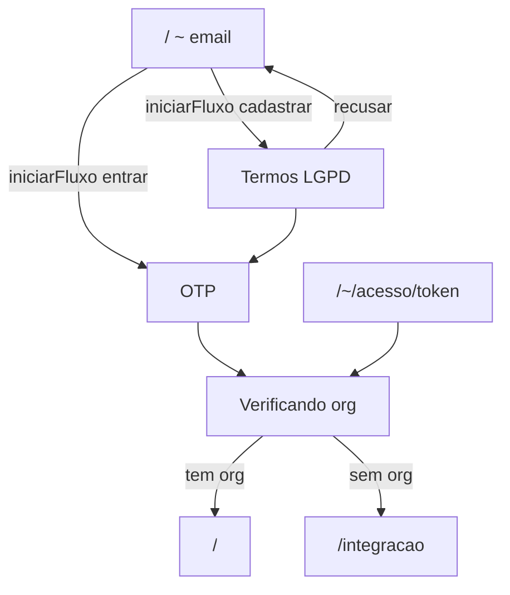

# Auth multi-step — web.whasap.com.br

SPA client-first: rotas de página no browser; dados via `/rpc` (server route in-process, `@whasap/api-web`).

Sem autenticação: redirect para **`/~`** (wizard SPA). Exceção: `/convite/$token`.

Com autenticação: o `organizacaoHash` (uuid da organização) vem da URL e é passado nas chamadas ORPC via `orgInput()`.

## Entrada e autenticação (`/~`)

Wizard SPA único em **`/~`** com 4 passos visuais (progress dots):

| Passo | UI | ORPC |
|-------|-----|------|
| E-mail | `EntradaStepEmail` | `autenticacao.iniciarFluxo` |
| Termos (cadastro) | `EntradaStepTermos` | — (LGPD em `cadastrarFluxo`) |
| OTP | `EntradaStepOtp` | `enviarOtpFluxo` (auto no mount) → `entrarFluxo` / `cadastrarFluxo` |
| Verificando | `EntradaStepVerificando` | `organizacao.lista` → redirect |

| Rota | Descrição |
|------|-----------|
| `/~` | Wizard completo (email → termos? → OTP → verificação) |
| `/~/acesso/{token}` | Link mágico do e-mail OTP → sessão → redirect `/` |
| `/~/email/{emailHash}/bloqueado` | Bloqueio após 10 OTPs pedidos ou 10 tentativas inválidas |

**Rotas removidas:** `/~/{hash}`, `/~/email/{emailHash}` (estado do fluxo fica no reducer local; refresh reinicia).

Pós-login: `/` → org ou `/integracao`.

## Demonstração gratuita (3 dias por org)

Trial **por organização**, contado em dias corridos (`America/Sao_Paulo`) a partir de `demonstracao_inicia_em` (1ª conexão WhatsApp).

| Dia | Estado | Painel |
|-----|--------|--------|
| 1 | `livre` | Sem banner; acesso total |
| 2–3 | `aviso` | Banner verde + CTA pagamento; acesso total |
| 4+ | `bloqueado` | Banner vermelho + overlay; API bloqueada |
| Com assinatura | `pago` | Sem banner |

**Pagamento:** botão no banner ou em `/{uuid}/ajustes` → `instancia.criarCheckout` → redirect Asaas → webhook ativa assinatura.

**Webhooks** (`apps/webhook`): Evolution, Meta e Asaas continuam sem bloqueio.

Estado exposto em `organizacao.obter` → campo `demonstracao`.

### API allowlist quando `bloqueado`

Continua funcionando: `autenticacao.*`, `organizacao.obter`, `organizacao.lista`, `instancia.lista`, `instancia.obter`, `instancia.criarCheckout`, `cobranca.*`.

Bloqueado: inbox, envio, criar/provisionar instância, equipe, relatórios, etc.

### Migration

Campo `demonstracao_inicia_em` em `organizacao` — gerar/aplicar pelo desenvolvedor (`db:generate`, `db:migrate`).

## Onboarding de instância

| Rota | Descrição |
|------|-----------|
| `/integracao` | Criar organização (primeira ou adicional) |
| `/{uuid}/integracao` | Tipo de conexão → QR / Cloud API → painel (sem checkout) |

Fluxo: `tipo` → `conexao` → `concluido` → redirect `/{uuid}/`.

Ao conectar: status `connected` + inicia demonstração da org.

## Painel autenticado

| Rota | Descrição |
|------|-----------|
| `/` | Redirect: sem org → `/integracao`; com org → `/{uuid}/` |
| `/{uuid}/` | Home — inbox / empty state |
| `/{uuid}/instancias` | Lista e contratação de instâncias |
| `/{uuid}/integracao` | Config pós-primeira org (provider + conexão) |
| `/{uuid}/inbox/$instanceId` | Inbox por instância |
| `/{uuid}/relatorios` | BI (admin + analista) |
| `/{uuid}/equipe` | Membros e convites (admin) |
| `/{uuid}/ajustes` | Org + cobrança Asaas + configurar pagamento |
| `/convite/$token` | Aceitar convite → redirect `/{uuid}/` |

Gate de onboarding: redirect para `/{uuid}/integracao` se **nenhuma instância conectada** (não exige assinatura).

| `/rpc`, `/rpc/*` | ORPC embutido (server-only) |

## ORPC — fluxo de autenticação

| Procedimento | Uso |
|--------------|-----|
| `autenticacao.iniciarFluxo` | E-mail → hash + tipo |
| `autenticacao.obterFluxo` | Estado do fluxo (link mágico / bloqueio) |
| `autenticacao.enviarOtpFluxo` | Envia OTP + link mágico |
| `autenticacao.entrarFluxo` | Login com hash + OTP → `{}` + cookie JWT |
| `autenticacao.cadastrarFluxo` | Cadastro com hash + OTP + LGPD → `{}` + cookie JWT |
| `autenticacao.consumirLinkMagico` | Link mágico → `{}` + cookie JWT |
| `autenticacao.eu` | Sessão atual (requer cookie JWT válido) |

Tabela `fluxo_autenticacao` (migration pelo desenvolvedor).
