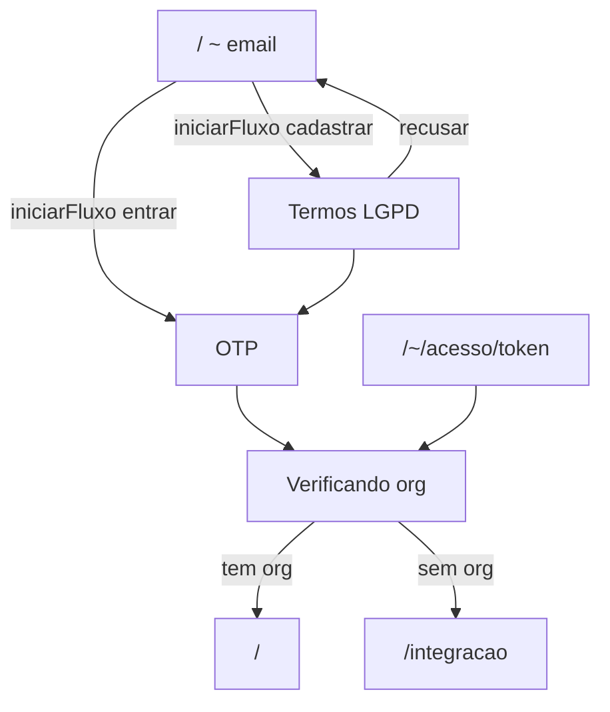

# Auth multi-step — web.whasap.com.br

SPA client-first: rotas de página no browser; dados via `/rpc` (server route in-process, `@whasap/api-web`).

Sem autenticação: redirect para **`/~`** (wizard SPA). Exceção: `/convite/$token`.

Com autenticação: o `organizacaoHash` (uuid da organização) vem da URL e é passado nas chamadas ORPC via `orgInput()`.

## Entrada e autenticação (`/~`)

Wizard SPA único em **`/~`** com 4 passos visuais (progress dots):

| Passo | UI | ORPC |
|-------|-----|------|
| E-mail | `EntradaStepEmail` | `autenticacao.iniciarFluxo` |
| Termos (cadastro) | `EntradaStepTermos` | — (LGPD em `cadastrarFluxo`) |
| OTP | `EntradaStepOtp` | `enviarOtpFluxo` (auto no mount) → `entrarFluxo` / `cadastrarFluxo` |
| Verificando | `EntradaStepVerificando` | `organizacao.lista` → redirect |

| Rota | Descrição |
|------|-----------|
| `/~` | Wizard completo (email → termos? → OTP → verificação) |
| `/~/acesso/{token}` | Link mágico do e-mail OTP → sessão → redirect `/` |
| `/~/email/{emailHash}/bloqueado` | Bloqueio após 10 OTPs pedidos ou 10 tentativas inválidas |

**Rotas removidas:** `/~/{hash}`, `/~/email/{emailHash}` (estado do fluxo fica no reducer local; refresh reinicia).

Pós-login: `/` → org ou `/integracao`.

## Cadastro fiscal e cobrança

Painel **liberado desde o início** — sem banner de trial nem lockout.

| Aspecto | Comportamento |
|---------|---------------|
| Acesso | Total ao painel após login e criação da org |
| Cobrança | Manual — teste de **7 dias**, boleto por uso após o período |
| Referência | Termo de adesão em [whasap.com.br/legal#adesao](https://whasap.com.br/legal#adesao) |
| Integração Asaas | Removida — sem checkout in-app, sem webhook de pagamento |

**Webhooks** (`apps/webhook`): Evolution e Meta continuam sem bloqueio.

## Onboarding de organização e instância

| Rota | Descrição |
|------|-----------|
| `/integracao` | Criar organização — nome, CNPJ, razão social, WhatsApp de contato, aceite do termo de adesão |
| `/{uuid}/integracao` | Tipo de conexão → QR / Cloud API → painel |

Campos obrigatórios em `/integracao` (`organizacao.criar`): `nome`, `documento` (CNPJ), `razaoSocial`, `telefoneWhatsapp`, `aceiteAdesao: true`. O aceite grava `aceiteAdesaoEm` e `aceiteAdesaoVersao` no banco.

Fluxo de conexão: `tipo` → `conexao` → `concluido` → redirect `/{uuid}/`. Ao conectar: status `connected` (sem gate de pagamento).

## Painel autenticado

| Rota | Descrição |
|------|-----------|
| `/` | Redirect: sem org → `/integracao`; com org → `/{uuid}/` |
| `/{uuid}/` | Home — inbox / empty state |
| `/{uuid}/instancias` | Lista e contratação de instâncias |
| `/{uuid}/integracao` | Config pós-primeira org (provider + conexão) |
| `/{uuid}/inbox/$instanceId` | Inbox por instância |
| `/{uuid}/relatorios` | BI (admin + analista) |
| `/{uuid}/equipe` | Membros e convites (admin) |
| `/{uuid}/ajustes` | Dados da org (cadastro fiscal, aceite do termo) |
| `/{uuid}/ajustes/conexao` | Preferências de conexão |
| `/convite/$token` | Aceitar convite → redirect `/{uuid}/` |

Gate de onboarding: redirect para `/{uuid}/integracao` se **nenhuma instância conectada**.

| `/rpc`, `/rpc/*` | ORPC embutido (server-only) |

## ORPC — fluxo de autenticação

| Procedimento | Uso |
|--------------|-----|
| `autenticacao.iniciarFluxo` | E-mail → hash + tipo |
| `autenticacao.obterFluxo` | Estado do fluxo (link mágico / bloqueio) |
| `autenticacao.enviarOtpFluxo` | Envia OTP + link mágico |
| `autenticacao.entrarFluxo` | Login com hash + OTP → `{}` + cookie JWT |
| `autenticacao.cadastrarFluxo` | Cadastro com hash + OTP + LGPD → `{}` + cookie JWT |
| `autenticacao.consumirLinkMagico` | Link mágico → `{}` + cookie JWT |
| `autenticacao.eu` | Sessão atual (requer cookie JWT válido) |

Tabela `fluxo_autenticacao` (migration pelo desenvolvedor).
