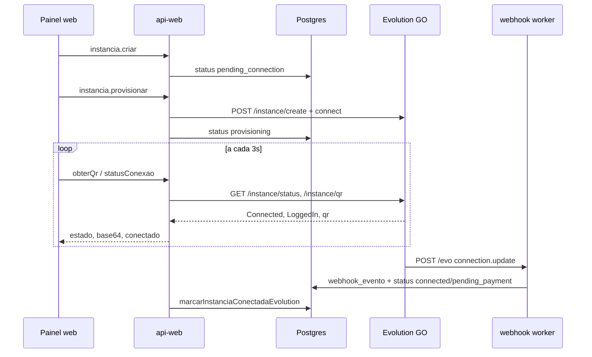

# Fluxo de instância Evolution (WhatsApp Comercial)

Documentação do ciclo de vida de uma instância `evolution`: de onde vêm os status exibidos no painel, como polling e webhooks se complementam, e como debugar descompassos.

## Visão geral



## Três fontes de verdade

| Fonte | O que representa | Onde é lida |
|-------|------------------|-------------|
| **Banco (`instancia.status`)** | Estado de negócio Whasap (cobrança, onboarding) | Lista de instâncias, badges, gates de onboarding |
| **Evolution REST** (`GET /instance/status`) | Sessão WhatsApp ao vivo | `obterQr`, `statusConexao` (polling na integração) |
| **Webhook Evolution** (`connection.update`) | Eventos assíncronos da sessão | Atualiza banco; log em `webhook_evento` + R2 |

O painel pode mostrar **"Provisionando"** no badge (banco) enquanto a integração já exibe QR ou "Aguardando QR" (Evolution ao vivo). Isso é esperado até o banco receber `connected` ou `pending_payment`.

## Status no banco (`instancia.status`)

| Valor DB | Rótulo UI | Quem grava |
|----------|-----------|------------|
| `pending_connection` | Configurando | `instancia.criar` |
| `provisioning` | Provisionando | `instancia.provisionar` |
| `pending_payment` | Aguardando pagamento | Conexão sem assinatura Asaas |
| `connected` | Conectada | Conexão com assinatura, Cloud API, ou pós-checkout |
| `disconnected` | Desconectada | Webhook `connection.update` com `close` |
| `deactivated` | Desativada | Cancelamento Asaas |

Função unificada pós-conexão Evolution: `marcarInstanciaConectadaEvolution` em `@whasap/api-core` (usa `pending_payment` se não houver `asaasIdAssinatura`).

No disconnect, `marcarInstanciaDesconectadaEvolution` grava `status = disconnected` e `desconectadoEm = now()`. Na reconexão, `desconectadoEm` é limpo.

## Limpeza de abandono (`whasap-evolution-cleanup`)

Worker dedicado (`apps/evolution-cleanup`) com Cron Trigger a cada 15 minutos. Varre instâncias `evo` não excluídas em `pending_connection`, `provisioning` ou `disconnected` há mais de 30 minutos:

| Situação | Timestamp de referência |
|----------|-------------------------|
| `disconnected` | `desconectadoEm` (fallback `atualizadoEm`) |
| `pending_connection` / `provisioning` sem nunca ter conectado | `criadoEm` |
| mesmos status após já ter conectado (ex. pós-`encerrarPareamento`) | `atualizadoEm` |

Ação: soft-delete + limpeza Evolution (`disconnect` / `deleteInstance`). Se houver `asaasIdAssinatura`, o slot pago é preservado criando uma nova instância `pending_connection` (addons reapontados).

Constantes: `mvpDefaults.evolution.abandonedAfterMinutes`. Lógica: `varrerInstanciasEvolutionAbandonadas` em `@whasap/api-core`.

## Status ao vivo Evolution (REST)

Parser: `parseGoConnectionState` em `@whasap/evolution` (`connection-state.ts`).

| Resposta GO (`data`) | Estado normalizado |
|----------------------|-------------------|
| `LoggedIn: true` | `open` |
| `Connected: false` | `close` |
| `Connected: true`, `LoggedIn: false` | `connecting` (pareamento) |
| `state: "open"` (Baileys) | `open` |

QR: `parseGoQrResponse` — suporta campo `qr` no formato `base64|codigo`.

## Onde a UI lê cada dado

| Tela / elemento | Fonte |
|-----------------|-------|
| Badge "Provisionando" na lista | **Banco** (`instancia.lista`) |
| Texto "Provisionando..." na integração | **Mutation** `provisionar.isPending` (local) |
| Imagem QR / pairing code | **Evolution** via `obterQr` |
| Botão "WhatsApp conectado" | **Evolution** via `statusConexao.conectado` |
| Org considerada conectada (onboarding) | **Banco** — alguma instância com `status === "connected"` |

## Persistência de webhooks

Todo `POST /evo` passa por:

1. **R2** `whasap` — `webhook/evo/{instance}/{date}/{event}-{time}-{id}.json`
2. **Postgres** `webhook_evento` — payload completo + `processadoEm`
3. **Processor** — só `connection.update` e `messages.upsert` alteram domínio; demais eventos ficam só no log

## Debug

### Painel web (`EVOLUTION_DEBUG=true`)

No worker `web`, defina `EVOLUTION_DEBUG=true` (`.dev.vars` local; `wrangler.jsonc` vars em produção — default `false`).

As respostas de `obterQr` e `statusConexao` incluem `_debug`:

- `statusBruto` / `qrBruto` — JSON da Evolution (tokens redigidos)
- `erro` / `statusHttp` — falhas de chamada

Na página de integração, bloco colapsável **Debug Evolution (temporário)** quando `_debug` está presente.

### Office (equipe interna)

| Rota | Função |
|------|--------|
| `/administracao/webhooks` | Lista `webhook_evento` (filtro por `instanciaId`) |
| `/administracao/instancias/{uuid}` | Banco vs Evolution lado a lado |

API ORPC: `administracao.webhooks.lista`, `.obter`, `administracao.instancias.estadoEvolution`.

Bindings necessários no worker `office`: R2 `whasap`, `EVOLUTION_SECRETS_STORE`.

### SQL útil

```sql
SELECT id, origem, id_evento, processado_em, criado_em,
       payload::jsonb->>'event' AS evento
FROM webhook_evento
WHERE origem = 'evo'
ORDER BY criado_em DESC
LIMIT 20;
```

### R2

**Webhooks recebidos** — prefixo: `webhook/evo/{evolucaoNomeInstancia}/{YYYY-MM-DD}/`

**Ações outbound (Evolution GO client)** — prefixo: `acao/{tipo}/{YYYY-MM-DD}/{HH-mm-ss}.{uuid}.json`

Exemplos de `tipo`: `instance_create`, `instance_connect`, `instance_qr`, `instance_status`, `instance_disconnect`, `send_text`, `message_downloadmedia`.

Com `estado === "close"`, `obterQr` chama `connect` antes de tentar QR (sessão GO inativa). Na mesma requisição retorna `connecting`; no poll seguinte chama `GET /instance/qr` (timeout 20s, log `instance_qr`).

Chave com instância: `acao/{instanciaUuid}/{tipo}/{YYYY-MM-DD}/{HH-mm-ss}.{uuid}.json`

## Correções desta entrega

- Parser alinhado ao formato GO (`Connected` / `LoggedIn`, QR pipe)
- `provisionar` envia `subscribe: ["ALL"]` no primeiro `connect`
- Polling e webhook usam a mesma regra de `connected` vs `pending_payment`
- Webhook `close` grava `disconnected`
- Debug temporário no RPC + office

## Referências no código

- Parsers: [`packages/evolution/src/connection-state.ts`](../packages/evolution/src/connection-state.ts)
- Handlers painel: [`packages/api-web/src/handlers/instancia.ts`](../packages/api-web/src/handlers/instancia.ts)
- Marcação DB: [`packages/api-core/src/lib/instancia-evolution.ts`](../packages/api-core/src/lib/instancia-evolution.ts)
- Sweep abandono: [`packages/api-core/src/lib/instancia-evolution-abandonada.ts`](../packages/api-core/src/lib/instancia-evolution-abandonada.ts) + worker [`apps/evolution-cleanup`](../apps/evolution-cleanup)
- Log R2 ações: [`packages/api-core/src/lib/evolution-acao-r2-log.ts`](../packages/api-core/src/lib/evolution-acao-r2-log.ts)
- Webhook processor: [`apps/webhook/src/processors.ts`](../apps/webhook/src/processors.ts)
- Rótulos UI: [`apps/web/src/lib/instancia-status.ts`](../apps/web/src/lib/instancia-status.ts)
