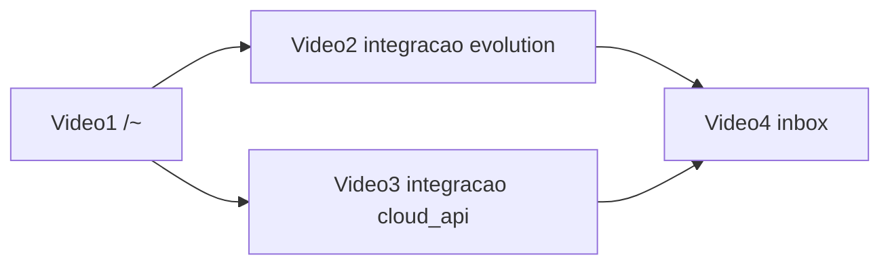

# Tutoriais e vídeos demonstrativos — checklist

Checklist para gravar 4 vídeos do painel Whasap. Base: `https://web.whasap.com.br`.

Substitua `{uuid}` pelo hash da organização (visível na URL após criar a conta).

---

## Visão geral dos vídeos

| # | Título | Onde termina |
|---|--------|--------------|
| 1 | Criar conta | Organização criada; **antes** de conectar WhatsApp |
| 2 | Configurar WhatsApp Comercial | Instância Evolution conectada via QR |
| 3 | Configurar WhatsApp Cloud API | Instância Cloud API conectada (aba Manual) |
| 4 | Iniciar uma conversa | Responder mensagem na inbox |

---

## Vídeo 1 — Criar conta

**Objetivo:** cadastro completo + primeira organização. Não conectar WhatsApp neste vídeo.

**Pré-requisitos**

- [ ] E-mail demo novo (nunca usado no Whasap)
- [ ] Acesso à caixa de entrada do e-mail (OTP ou link mágico)

**Rotas e passos**

| # | Rota | Ação na tela |
|---|------|--------------|
| 1 | `/~` | Informar e-mail → Continuar |
| 2 | `/~` | Aceitar termos LGPD (só no cadastro) → Continuar |
| 3 | `/~` | Digitar código OTP **ou** abrir link mágico do e-mail |
| 3b | `/~/acesso/{token}` | Alternativa: link mágico do e-mail entra direto aqui |
| 4 | `/~` | Passo “Verificando” → redirect automático |
| 5 | `/integracao` | Nome da organização → **Criar organização** |
| 6 | `/{uuid}/integracao` | Mostrar tela “Tipo de conexão” e **encerrar** (não clicar em Continuar) |

**O que narrar**

- [ ] Fluxo sem senha (e-mail + OTP)
- [ ] Após criar a org, o painel pede conexão WhatsApp (gancho para vídeos 2 e 3)

**Checklist de gravação**

- [ ] Roteiro escrito
- [ ] Take gravado (ocultar e-mail real se necessário)
- [ ] Thumbnail + publicação

---

## Vídeo 2 — Configurar WhatsApp Comercial

**Objetivo:** conectar via QR Code (**WhatsApp Comercial** na UI).

**Pré-requisitos**

- [ ] Conta logada com organização **sem** instância conectada (ideal: org criada no vídeo 1)
- [ ] Celular com WhatsApp para escanear o QR

**Rotas e passos**

| # | Rota | Ação na tela |
|---|------|--------------|
| 1 | `/{uuid}/integracao` | Se não estiver aqui, o painel redireciona automaticamente |
| 2 | `/{uuid}/integracao` | Selecionar **WhatsApp Comercial** |
| 3 | `/{uuid}/integracao` | Nome da instância (ex.: “Atendimento”) → **Continuar** |
| 4 | `/{uuid}/integracao?instance={instanciaId}` | Aguardar provisionamento → exibir QR Code |
| 5 | (celular) | WhatsApp → Aparelhos conectados → Escanear QR |
| 6 | `/{uuid}/integracao?instance={instanciaId}` | Status conectado → tela “Concluído” |
| 7 | `/{uuid}/` | Redirect automático para home (inbox) |

**O que narrar**

- [ ] Usar sempre o rótulo **WhatsApp Comercial** (nunca “Evolution” na fala)
- [ ] Demonstração gratuita de 3 dias começa na 1ª conexão

**Checklist de gravação**

- [ ] Roteiro escrito
- [ ] Take do QR em close-up (celular) + tela do painel
- [ ] Thumbnail + publicação

---

## Vídeo 3 — Configurar WhatsApp Cloud API

**Objetivo:** conectar via credenciais da Meta (**WhatsApp Cloud API** na UI).

**Pré-requisitos**

- [ ] Conta/org **separada** do vídeo 2 (recomendado) ou org sem instância conectada
- [ ] Phone Number ID, WABA ID e Access Token da Meta (dados demo; não gravar token real)

**Rotas e passos**

| # | Rota | Ação na tela |
|---|------|--------------|
| 1 | `/{uuid}/integracao` | Entrar no wizard de configuração |
| 2 | `/{uuid}/integracao` | Selecionar **WhatsApp Cloud API** |
| 3 | `/{uuid}/integracao` | Nome da instância → **Continuar** |
| 4 | `/{uuid}/integracao?instance={instanciaId}` | Aba **Manual** (não Embedded Signup, a menos que Meta esteja configurada) |
| 5 | `/{uuid}/integracao?instance={instanciaId}` | Preencher Phone Number ID, WABA ID, Access Token |
| 6 | `/{uuid}/integracao?instance={instanciaId}` | **Salvar e continuar** → status conectado |
| 7 | `/{uuid}/` | Redirect para home |

**O que narrar**

- [ ] Diferença em uma frase: API oficial da Meta vs QR do WhatsApp Comercial
- [ ] Credenciais vêm do Meta Business / Developers

**Checklist de gravação**

- [ ] Roteiro escrito
- [ ] Borrar ou substituir token na edição
- [ ] Thumbnail + publicação

---

## Vídeo 4 — Iniciar uma conversa

**Objetivo:** receber e responder uma mensagem na inbox.

**Pré-requisitos**

- [ ] Instância **conectada** (vídeo 2 ou 3)
- [ ] Segundo celular (ou WhatsApp Web) envia mensagem **para o número conectado** antes/durante a gravação
- [ ] Anotar `{instanciaId}` (lista em `/{uuid}/instancias` ou card na home)

**Rotas e passos**

| # | Rota | Ação na tela |
|---|------|--------------|
| 1 | `/{uuid}/` | Home — card da instância → **Abrir inbox** |
| 1b | `/{uuid}/inbox/{instanciaId}` | Atalho direto para a inbox |
| 2 | `/{uuid}/inbox/{instanciaId}` | Lista **Conversas** — clicar no contato que enviou mensagem |
| 3 | `/{uuid}/inbox/{instanciaId}` | Ler histórico (mensagem inbound aparece à esquerda) |
| 4 | `/{uuid}/inbox/{instanciaId}` | Digitar resposta no composer → enviar |
| 5 | (celular) | Confirmar que a resposta chegou no WhatsApp do cliente |

**O que narrar**

- [ ] Conversas entram quando o **cliente escreve primeiro** (webhook)
- [ ] Painel: lista à esquerda, thread à direita, composer embaixo
- [ ] Cloud API: fora da janela de 24h o composer fica bloqueado (mencionar só se gravar com Cloud)

**Opcional no mesmo vídeo**

- [ ] Enviar anexo (tipo imagem/documento) pelo seletor de mídia do composer
- [ ] **Atribuir** conversa a um membro da equipe

**Checklist de gravação**

- [ ] Mensagem de teste preparada no celular auxiliar
- [ ] Take da lista + envio + confirmação no celular
- [ ] Thumbnail + publicação

---

## Ambiente de gravação (todos os vídeos)

- [ ] Conta/org demo com nomes genéricos (“Loja Demo”, “Atendimento”)
- [ ] Browser em 100–125% de zoom
- [ ] Notificações do SO desligadas
- [ ] Sem abas extras; sem dados sensíveis na tela (tokens, e-mails reais)
- [ ] Áudio testado antes de gravar

---

## Ordem de produção

1. [ ] Vídeo 1 — Criar conta
2. [ ] Vídeo 2 — WhatsApp Comercial
3. [ ] Vídeo 3 — WhatsApp Cloud API
4. [ ] Vídeo 4 — Iniciar uma conversa

---

## Links publicados

| Vídeo | Status | URL |
|-------|--------|-----|
| 1 — Criar conta | pendente | |
| 2 — WhatsApp Comercial | pendente | |
| 3 — WhatsApp Cloud API | pendente | |
| 4 — Iniciar uma conversa | pendente | |

---

## Referência rápida de rotas

| Rota | Uso |
|------|-----|
| `/~` | Login / cadastro (e-mail → termos → OTP) |
| `/~/acesso/{token}` | Link mágico do e-mail |
| `/integracao` | Criar primeira organização |
| `/{uuid}/integracao` | Wizard: tipo → conexão → concluído |
| `/{uuid}/` | Home / inbox (cards das instâncias) |
| `/{uuid}/inbox/{instanciaId}` | Caixa de entrada |
| `/{uuid}/instancias` | Lista de WhatsApps da org |

**Regras do produto**

- Sem instância conectada → redirect para `/{uuid}/integracao` (exceto `/ajustes`)
- UI: **WhatsApp Comercial** / **WhatsApp Cloud API** (nunca Evolution/Baileys na interface)
- Demonstração: 3 dias corridos a partir da 1ª conexão WhatsApp
